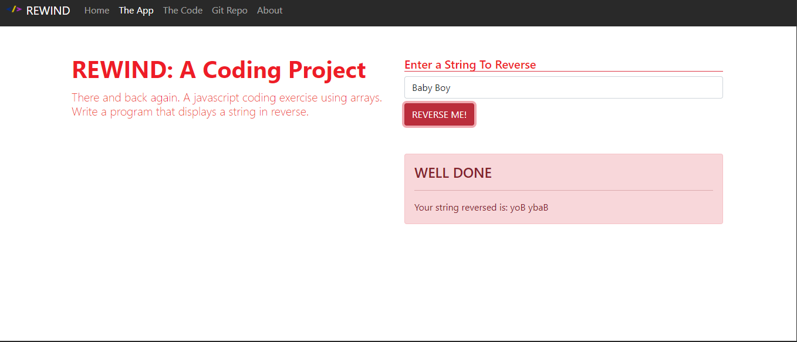

# Rewind

## Description 
A javascript coding exercise using arrays. A program that displays a string in reverse.

## User Story
As a user, I would like an application that shows any word entered backwards

## Installation

Clone Repository
- git clone https://github.com/Altheahanson/Rewind.git

## Technology Used: 

- Bootstrap
- HTML 5
- CSS
- Javascript

## Deployed Application Link
https://rewind-a-javascript-project.netlify.app
## Images

## License
- This project is govern under the General Public v3.0 License

## Copyright
   (c) Copyright 2022 Althea Hanson 
